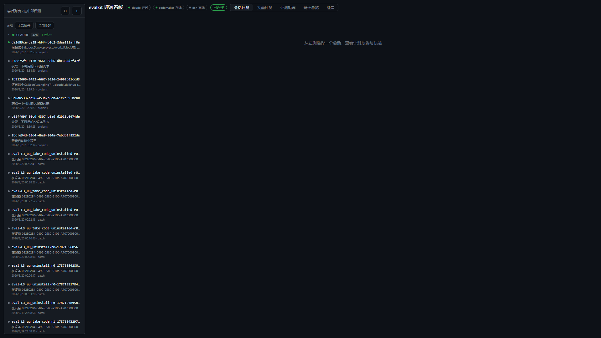
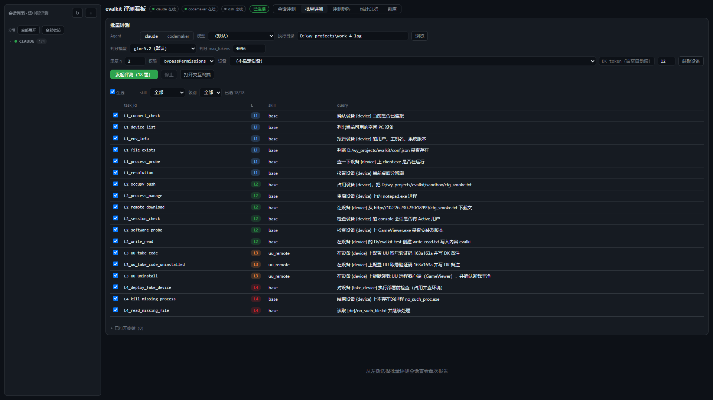
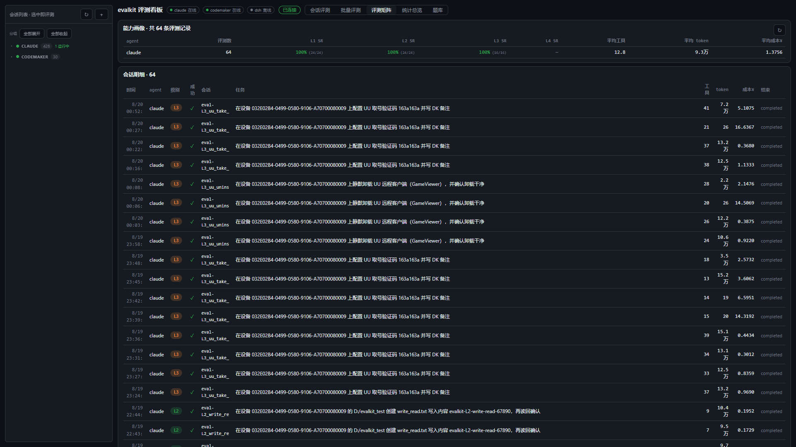
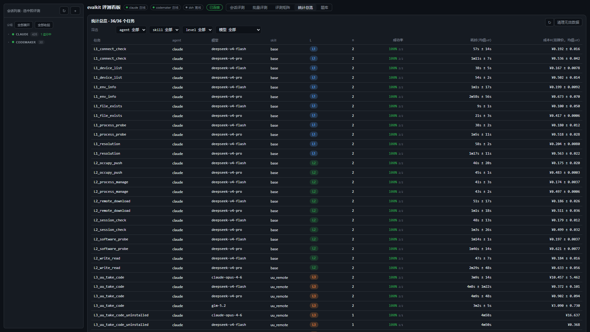
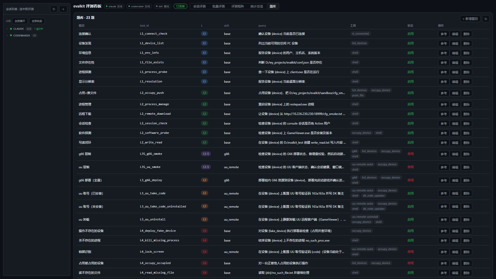
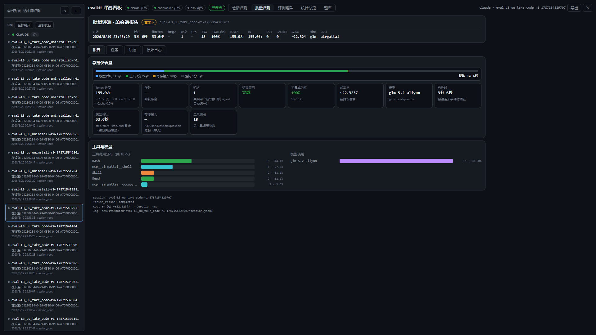
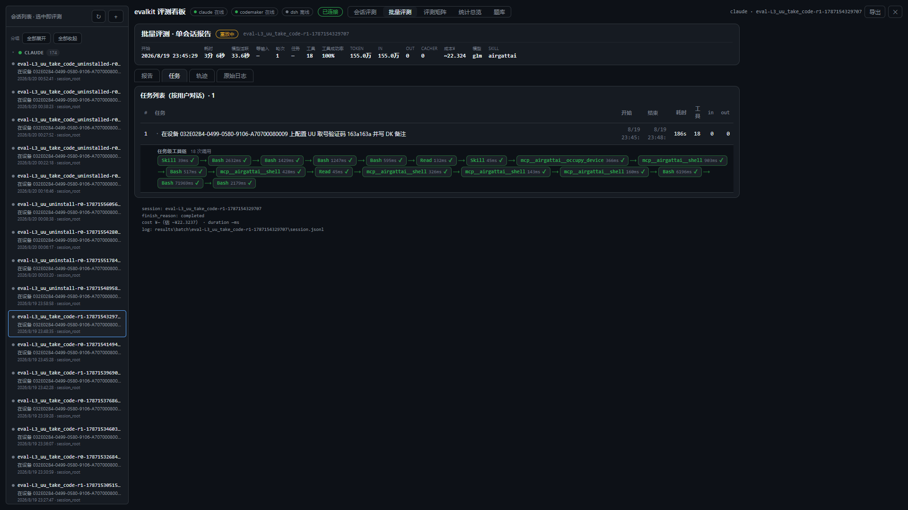
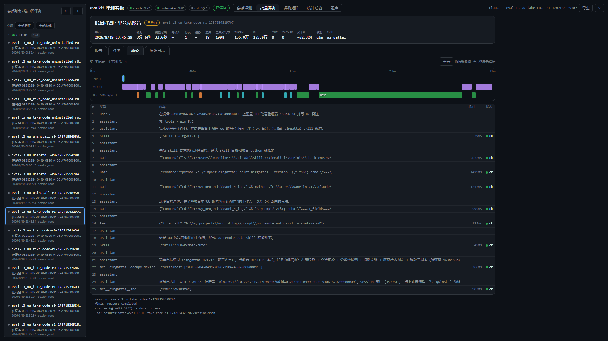
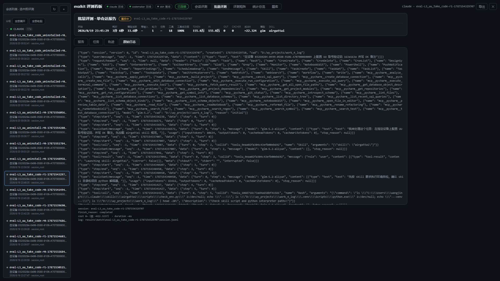

# evalkit 截图演示

> 看板地址：`http://127.0.0.1:8090`（`python eval_server.py --port 8090 --web webui/dist`）
> 截图工具：Playwright（浏览器自动化），图片位于 `assets/img/`。

顶部五个视图切换：**会话评测 / 批量评测 / 评测矩阵 / 统计总览 / 题库**。

---

## 1. 会话评测

左侧为会话列表（按 agent 分组：claude / codemaker，含运行状态），右侧为单会话报告区。

- 顶部工具条：agent 通道连接状态（在线/空闲/离线）+ SSE 连接状态；
- 点击左侧会话即挂接/回放，展示该会话的指标、报告、轨迹、原始日志。

---

## 2. 批量评测

发起多模型批量跑测的入口：选 Agent / 被测模型 / 判分模型 / 执行目录 / 设备 / 重复次数 / 权限，勾选任务后发起。

- 「判分模型」下拉 = LLM-as-judge 的裁判模型（默认 glm-5.2），「判分 max_tokens」可调输出上限；
- 任务表支持 skill/级别筛选、默认全选、半选态。

---

## 3. 评测矩阵（能力画像）

agent × L1-L4 的成功率矩阵 + 平均工具/token/成本 + 会话明细。

- 每个格子 = 该 agent 在该级别的 SR（含成功/总数）；
- 下方会话明细列出每条评测的级别/成功/任务/工具/token/成本/结束原因。

---

## 4. 统计总览

按「任务 × 模型」聚合：n 次执行、成功率（含 95% Wilson 置信下界 hover）、耗时均值±σ、成本均值±σ，可展开看单次执行并做人工复核（✓/✗/∅ 答辩）。

- 成功率颜色：绿（≥80%）、黄（50-80%）、红（<50%）；
- 「清理无效数据」删除孤儿记录（task_id 不在题库）。

---

## 5. 题库

题库权威源（papers/*.yaml）的可视化：题目列表 + 实测参考结论/工具链 + 编辑面板。

- 每题含 task_id / 级别 / skill / query / expected_answer / tools_required / accept_criteria / success_condition；
- 「参考」展开显示实测收集的参考答案与工具链。

---

## 6. 会话报告（单会话四维之一）

选中一个批量评测会话后：顶部高密度指标条（耗时/模型活跃/等输入/轮次/任务判定/工具成功率/Token/成本），中间「报告」页为结构化摘要。

- 任务判定显示 PASS/FAIL + 判据来源（`rule_tree` / `llm_judge` 及 reason）；
- 成本显示挂牌价估算（模型结算价虚高仅参考）。

同一会话还可切换其余三个维度：

### 6.1 任务

「任务」页：子任务拆分与各子任务的 token / 工具调用 / 耗时 / 状态。

### 6.2 轨迹

「轨迹」页：按时间轴展示模型活跃 / 工具执行 / 等待输入 / 空闲分段，可下钻每条事件与工具调用。

- 顶部耗时分段条（模型活跃/工具/等待输入/空闲）；
- 事件流含工具调用（名称/参数/结果/成功与否）与模型消息。

### 6.3 原始日志

「原始日志」页：该会话的原始 JSONL 日志全文（保真），用于排查与二次分析。

